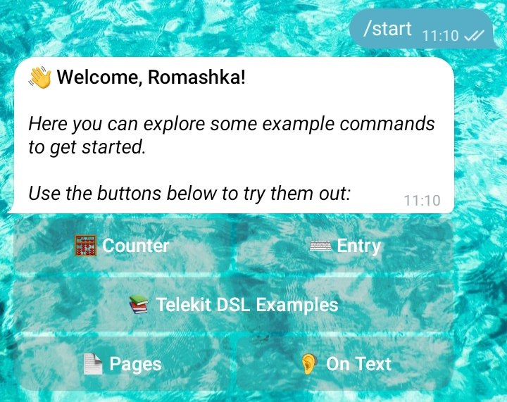
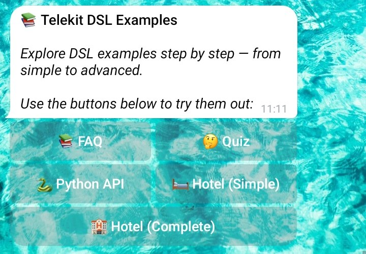
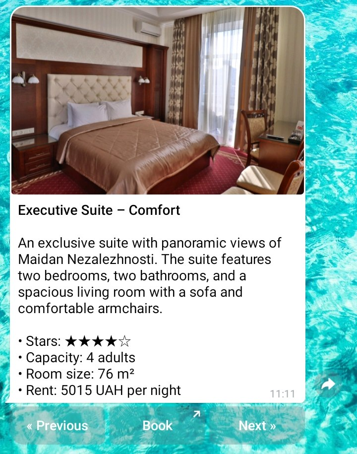

# Telekit Gallery

Some screenshots of [the example bot](https://github.com/Romashkaa/telekit/blob/main/docs/documentation/example_bot.md):

  
Basics (Click to See Photos)

  <table>
    <tr>
      <td></td>
      <td></td>
    </tr>
  </table>

  
Counter

  <table>
    <tr>
      <td></td>
      <td></td>
    </tr>
  </table>

  
Telekit DSL

  <table>
    <tr>
      <td></td>
      <td></td>
    </tr>
  </table>

  
Hotel Example

  <table>
    <tr>
      <td></td>
      <td></td>
    </tr>
  </table>

