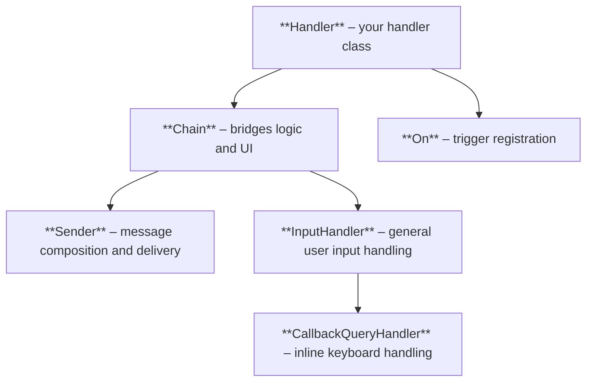

```mermaid
flowchart TD
    Handler["**Handler** – your handler class"]

    Handler --> Chain
    Handler --> On

    Chain["**Chain** – bridges logic and UI"]
    On["**On** – trigger registration"]

    Chain --> Sender
    Chain --> InputHandler

    Sender["**Sender** – message composition and delivery"]
    InputHandler["**InputHandler** – general user input handling"]

    InputHandler --> CallbackQueryHandler

    CallbackQueryHandler["**CallbackQueryHandler** – inline keyboard handling"]
```