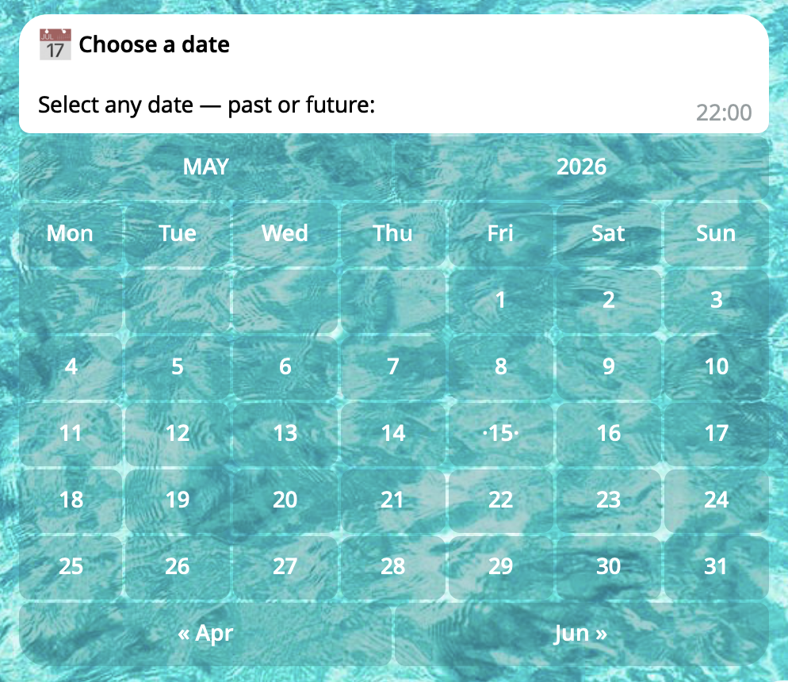

# Calandar Examples

## Minimal Example

This example demonstrates the simplest way to use the built-in CalendarPick trait. It allows a user to pick a date from an inline calendar and handles the result via a callback.

```py
class CalendarHandler(telekit.traits.CalendarPick, telekit.Handler):

    @classmethod
    def init_handler(cls) -> None:
        cls.on.command("calendar").invoke(cls.handle)

    def handle(self) -> None:
        self.chain.sender.set_title("📅 Choose a date")
        self.chain.sender.set_message("Select any date — past or future:")
        self.chain.sender.set_remove_text(False)

        self.calendar_pick(self.handle_date) # HERE

    def handle_date(self, date: datetime.date) -> None:
        self.chain.sender.set_text(f"You picked: {date}")
        self.chain.send()
```

<details>
  <summary>Result</summary>
  <table>
    <tr>
      <td></td>
    </tr>
  </table>
</details>

## Event Distance Bot

This example shows a more advanced use case: a bot that calculates how far a selected date is from today.

Works for both past events ("it was X ago") and future events ("it will be in X"):

```py
import datetime

import telekit

# ---------------------------------------------------------------------------
# Time-distance helpers
# ---------------------------------------------------------------------------

def _diff(a: datetime.date, b: datetime.date) -> tuple[int, int, int]:
    """
    Return the absolute difference between *a* and *b* as (years, months, days).

    Always returns non-negative values; direction is determined by the caller.

    :param a: First date.
    :param b: Second date (order does not matter).
    :returns: Tuple ``(years, months, days)`` with all values >= 0.
    """
    if a > b:
        a, b = b, a

    years  = b.year  - a.year
    months = b.month - a.month
    days   = b.day   - a.day

    if days < 0:
        months -= 1
        prev_month_last = (datetime.date(b.year, b.month, 1) - datetime.timedelta(days=1)).day
        days += prev_month_last

    if months < 0:
        years  -= 1
        months += 12

    return years, months, days


def _fmt(years: int, months: int, days: int) -> str:
    """
    Format a duration, omitting zero components.

    Examples::

        _fmt(0, 0, 1)  -> "1 day"
        _fmt(2, 3, 0)  -> "2 years and 3 months"
        _fmt(1, 0, 5)  -> "1 year and 5 days"

    :param years: Number of whole years.
    :param months: Number of remaining whole months.
    :param days: Number of remaining days.
    :returns: Human-readable duration string.
    """
    parts: list[str] = []
    if years:
        parts.append(f"{years} year{'s' if years != 1 else ''}")
    if months:
        parts.append(f"{months} month{'s' if months != 1 else ''}")
    if days:
        parts.append(f"{days} day{'s' if days != 1 else ''}")

    if not parts:
        return "today"
    if len(parts) == 1:
        return parts[0]
    return ", ".join(parts[:-1]) + " and " + parts[-1]


def _describe(chosen: datetime.date) -> str:
    """
    Build a human-readable distance string from *chosen* to today.

    :param chosen: The date selected by the user.
    :returns: Sentence describing how far the date is from today.
    """
    today    = datetime.date.today()
    y, mo, d = _diff(chosen, today)
    duration = _fmt(y, mo, d)

    if chosen == today:
        return "That's today! 🎉"
    elif chosen < today:
        return f"That was {duration} ago."
    else:
        return f"That will be in {duration}."

# ---------------------------------------------------------------------------
# Handler
# ---------------------------------------------------------------------------

class CalendarHandler(
    telekit.traits.CalendarPick,
    telekit.Handler,
):
    @classmethod
    def init_handler(cls) -> None:
        cls.on.command("start").invoke(cls.handle)

    def __init__(self, *args, **kwargs) -> None:
        super().__init__(*args, **kwargs)
        self._date: datetime.date | None = None

    def handle(self) -> None:
        self._date = None
        self.entry_date()

    # -----------------------------------------------------------------------
    # Calendar
    # -----------------------------------------------------------------------

    def entry_date(self) -> None:
        """
        Open the calendar picker.

        Restores the previously chosen date as the initial view so the user
        lands on a familiar position when changing their answer.
        """
        self.chain.sender.set_title("📅 Event Distance")
        self.chain.sender.set_message(
            "Pick any date and find out how far it is from today — "
            "whether it happened long ago or is still coming"
        )
        self.chain.sender.set_remove_text(False)

        self.calendar_pick(
            self.handle_date,
            initial=self._date,
            show_nav_hints=True,
        )

    # -----------------------------------------------------------------------
    # Result
    # -----------------------------------------------------------------------

    def handle_date(self, date: datetime.date) -> None:
        """
        Display the distance result for *date*.

        :param date: The date chosen by the user in the calendar.
        """
        self._date = date

        self.chain.sender.set_title(f"🗓 {date.strftime('%d %B %Y')}")
        self.chain.sender.set_message(
            _describe(date)
        )
        # « Change reopens the calendar at the previously selected month.
        self.chain.set_inline_keyboard(
            {
                "« Change": self.entry_date,
                "↺ Reset":  self.handle,
            },
            row_width=2,
        )
        self.chain.edit()


TOKEN: str = telekit.utils.read_token(".env")

telekit.Server(TOKEN).polling()
```