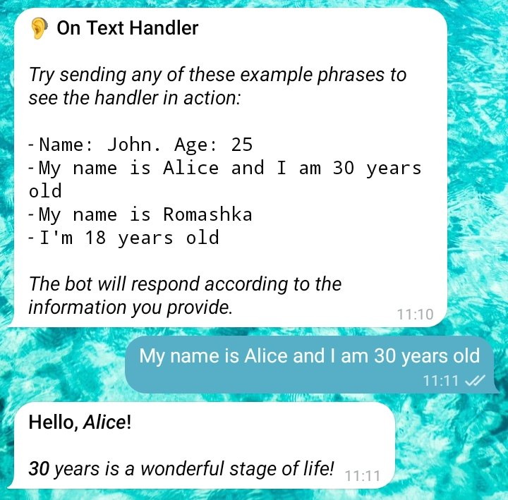

# On Text

Example of handling specific templated messages.

<details>
  <summary>Click to See Result</summary>
  
</details>

```py
import telekit

from telekit.styles import *

class OnTextHandler(telekit.Handler):

    @classmethod
    def init_handler(cls) -> None:
        cls.on.text(
            "Name: {name}. Age: {age}",
            "My name is {name} and I am {age} years old",
            "My name is {name}",
            "I'm {age} years old"
        ).invoke(cls.handle_name_age)

        cls.on.command("start").invoke(cls.handle)
            
    # ------------------------------------------
    # Handling Logic
    # ------------------------------------------

    def handle_name_age(self, name: str | None=None, age: str | None=None) -> None: 

        if not name: 
            name = self.user.first_name

        if not age:
            age = "An unknown number of"

        self.chain.sender.set_title(Composite("Hello, ", Italic(name), "!"))
        self.chain.sender.set_message(Italic(age), " years is a wonderful stage of life!")
        self.chain.disable_timeout_warnings()
        self.chain.send()

    # command

    def handle(self):
        self.chain.sender.set_title(f"🦻 On Text Handler")
        self.chain.sender.set_message(
            "Try sending any of these example phrases to see the handler in action:\n\n"

            "- ", Code('Name: John. Age: 25'), "\n"
            "- ", Code('My name is Alice and I am 30 years old'), "\n"
            "- ", Code('My name is Romashka'), "\n"
            "- ", Code('I\'m 18 years old'), "\n\n"

            "The bot will respond according to the information you provide."
        )
        self.chain.set_entry_suggestions(
            {
                "Test 1": "Name: John. Age: 25",
                "2": "My name is Alice and I am 30 years old",
                "3": "My name is Romashka",
                "4": "I'm 18 years old"
            }, row_width=4
        )
        self.chain.edit()

telekit.Server(TOKEN).polling()
```