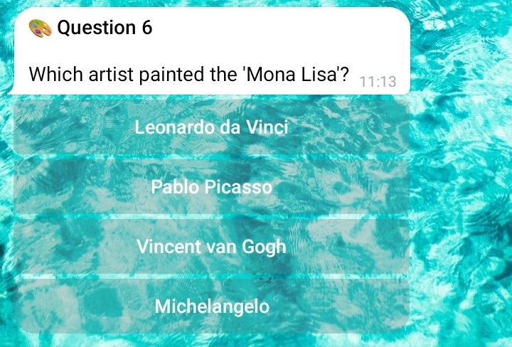

# Quiz

Example of a quiz written in Telekit DSL.

<details>
  <summary>Click to See Result</summary>
    
</details>

```python
import telekit

class QuizHandler(telekit.TelekitDSL.Mixin):
    @classmethod
    def init_handler(cls) -> None:
        cls.analyze_source(script)
        cls.on.command("start").invoke(cls.start_script)

# ------------------------------------------------------
# Telekit DSL
# ------------------------------------------------------
#
# Tuturial on GitHub: https://github.com/Romashkaa/telekit/blob/main/docs/tutorial/11_telekit_dsl.md
#

script = """
$ timeout {
    time = 20; // 20 sec.
}

@ main {
    title   = "🎉 Fun Facts Quiz";
    message = "Test your knowledge with 10 fun questions!";

    buttons {
        next("Start Quiz");
    }
}

@ question_1 {
    title   = "🐶 Question 1";
    message = "Which animal is the fastest on land?";
    buttons {
        _lose("Elephant");
        next("Cheetah");       // correct answer
        _lose("Horse");
        _lose("Lion");
    }
}

@ question_2 {
    title   = "🍫 Question 2";
    message = "From which product is chocolate made?";
    buttons {
        _lose("Cocoa powder");
        next("Cocoa beans");   // correct answer
        _lose("Cocoa butter");
        _lose("Cocoa drink");
    }
}

@ question_3 {
    title   = "🌌 Question 3";
    message = "Which planet is known for its prominent rings?";
    buttons {
        _lose("Jupiter");
        next("Saturn");        // correct answer
        _lose("Mars");
        _lose("Neptune");
    }
}

@ question_4 {
    title   = "🦎 Question 4";
    message = "Which animal can change the color of its skin?";
    buttons {
        next("Chameleon");     // correct answer
        _lose("Crocodile");
        _lose("Turtle");
        _lose("Snake");
    }
}

@ question_5 {
    title   = "🍌 Question 5";
    message = "Which vitamin is most abundant in a banana?";
    buttons {
        _lose("Vitamin C");
        next("Vitamin B6");    // correct answer
        _lose("Vitamin D");
        _lose("Vitamin A");
    }
}

@ question_6 {
    title   = "🎨 Question 6";
    message = "Which artist painted the 'Mona Lisa'?";
    buttons {
        next("Leonardo da Vinci"); // correct answer
        _lose("Pablo Picasso");
        _lose("Vincent van Gogh");
        _lose("Michelangelo");
    }
}

@ question_7 {
    title   = "🎵 Question 7";
    message = "Which musical instrument has 88 keys?";
    buttons {
        _lose("Guitar");
        _lose("Harmonica");
        next("Piano");          // correct answer
        _lose("Saxophone");
    }
}

@ question_8 {
    title   = "🧩 Question 8";
    message = "How many faces does a cube have?";
    buttons {
        _lose("6");
        next("6");             // correct answer
        _lose("8");
        _lose("12");
    }
}

@ question_9 {
    title   = "🌊 Question 9";
    message = "Which is the largest ocean on Earth?";
    buttons {
        next("Pacific Ocean"); // correct answer
        _lose("Atlantic Ocean");
        _lose("Indian Ocean");
        _lose("Arctic Ocean");
    }
}

@ question_10 {
    title   = "🍕 Question 10";
    message = "Which country is pizza originally from?";
    buttons {
        _lose("France");
        _end("Italy");          // correct answer
        _lose("Spain");
        _lose("USA");
    }
}

@ _lose {
    title   = "❌ Wrong Answer!";
    message = "Oops! That was not correct. Try again from the start.";

    buttons {
        back("« Retry");
    }
}

@ _end {
    title   = "🎉 Quiz Complete!";
    message = "Congratulations! You've completed the Fun Facts Quiz! 🌟\n\nWant to try again?";

    buttons {
        main("↺ Restart Quiz");
    }
}
"""

telekit.Server(TOKEN).polling()
```

- [See other examples »](https://github.com/Romashkaa/telekit/blob/main/docs/examples/examples.md#telekit-dsl)
