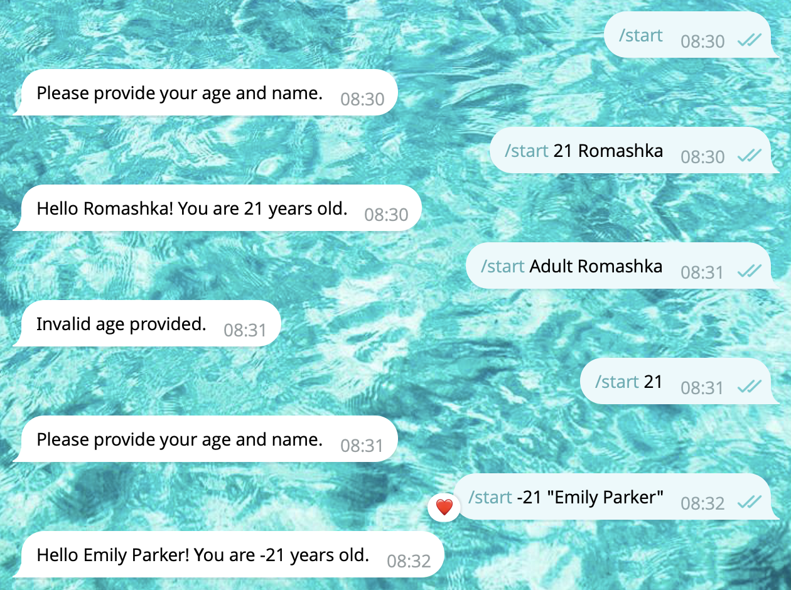

# Command Parameters: Deep Linking

Telekit allows you to define **commands with typed parameters** and handle **deep links** effortlessly. This makes it easy to pass arguments directly in the command call (like `/echo "hello"`) or through a URL link like `https://t.me/YourBot?start=parameter`.

## Basic Command with Parameters

You can define a command and specify expected parameter types using `telekit.parameters`:

```python
import telekit
from telekit.parameters import Int, Str

class StartHandler(telekit.Handler):

    @classmethod
    def init_handler(cls) -> None:
        # Define parameters: first an integer, then a string
        cls.on.command("start", params=[Int(-1), Str()]).invoke(cls.handle)
    
    # Default values are required:   ↓↓↓↓                   ↓↓↓↓
    def handle(self, age: int | None=None, name: str | None=None):
        if age is None or name is None:
            self.chain.sender.set_text("Please provide your age and name.")
        elif age == -1:
            self.chain.sender.set_text("Invalid age provided.")
        else:
            self.chain.sender.set_text(f"Hello {name}! You are {age} years old.")
        
        self.chain.send()
```

**Here:**
- `Int(-1)` means: if conversion to integer fails (non-integer input), the value will be `-1`.
- `Str()` accepts any string input (`Name` or `"Name Surname"`).
- Default values in the `handle` method (`age: int | None = None`) are used if the user does not provide these parameters.



## Using Deep Links

You can pass parameters directly via deep links:

```
https://t.me/BotUsername?start=airplane
```

Use the built-in `BotLink` class for this:

```py
from telekit.styles import BotLink
BotLink("Invitation link", username="BotUsername", start="airplane")
```

When someone opens a chat with your bot via this link, you will receive:

```
/start airplane
```

Then handle this parameter in your bot:

```python
import telekit
from telekit.parameters import Str

class StartHandler(telekit.Handler):

    @classmethod
    def init_handler(cls) -> None:
        # one string parameter from deep link
        cls.on.command("start", params=[Str()]).invoke(cls.handle)
    
    def handle(self, invite_code: str | None = None):
        if invite_code is None:
            self.chain.sender.set_text("This link is missing an invite code.")
        else:
            self.chain.sender.set_text(
                f"You joined via invite code: {invite_code}"
            )

        self.chain.sender.set_parse_mode("html")
        self.chain.send()
```

[See Example](https://github.com/Romashkaa/telekit/blob/main/docs/examples/command_parameters.md)

> [!TIP]
> Use `Sanitize` from `telekit.styles` when echoing user-provided strings to avoid HTML injection when using HTML parse mode.