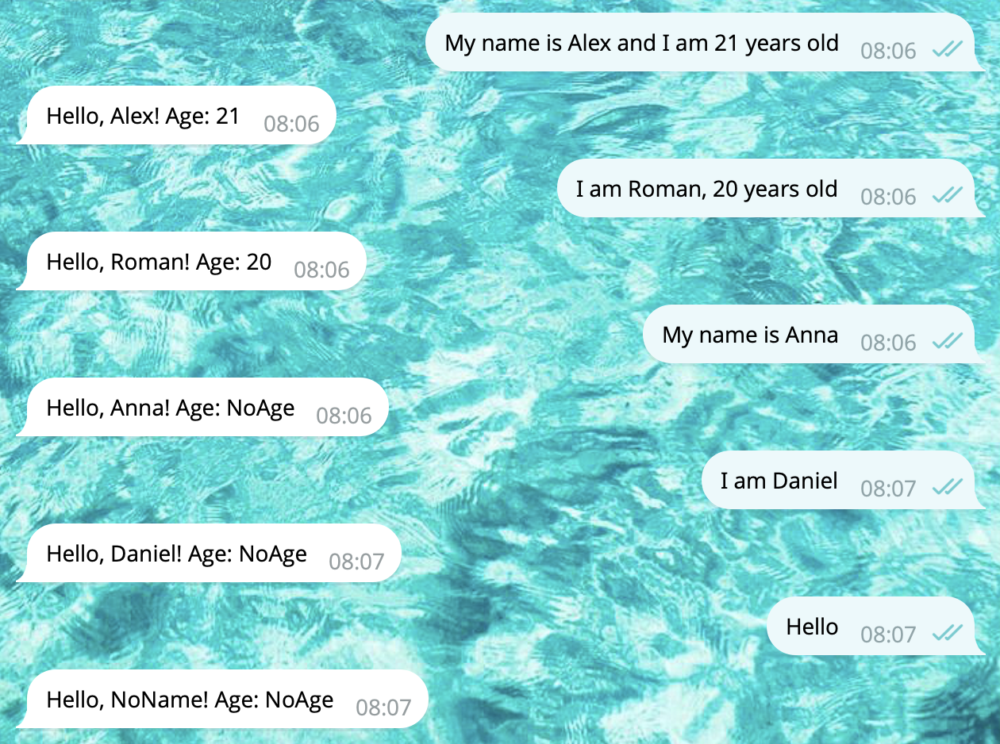

# Text Trigger Parameters

Patterns in `on.text` trigger can include placeholders in curly braces (like `{name}`) — they will be passed to the handle method as arguments.

Let’s react to messages like "My name is Alice" or "My Name Is Roman":

```python
import telekit

class NameHandler(telekit.Handler):

    @classmethod
    def init_handler(cls) -> None:
        # when a message matches "My name is {name}", call "handle_name" method:
        cls.on.text("my name is {name}").invoke(cls.handle_name)

    def handle_name(self, name: str) -> None:
        self.chain.sender.set_text(f"👋 Hello {name}!")
        self.chain.send()
 
telekit.Server(BOT_TOKEN).polling()
```

Here, `cls.on.text("my name is {name}")` listens for that pattern.
When triggered, the bot calls `handle_name()` with the extracted variable `name`.

## Multiple Patterns with Multiple Placeholders

You can pass two or more text patterns to a single trigger, even if they contain different numbers of placeholders.

```python
class NameHandler(telekit.Handler):
    @classmethod
    def init_handler(cls) -> None:
        # Important: start with more specific patterns first,
        # then fall back to more general ones
        cls.on.text(
            "my name is {name} and i am {age} years old",
            "i am {name}, {age} years old",
            "my name is {name}",
            "i am {name}"
        ).invoke(cls.handle)

        # Fallback: triggers on any text message
        cls.on.text().invoke(cls.handle)

    def handle(self, name: str = "NoName", age: str = "NoAge"):
        self.chain.sender.set_text(f"Hello, {name}! Age: {age}")
        self.chain.send()
```

> [!IMPORTANT]
> Start with more specific patterns first, then fall back to more general ones

